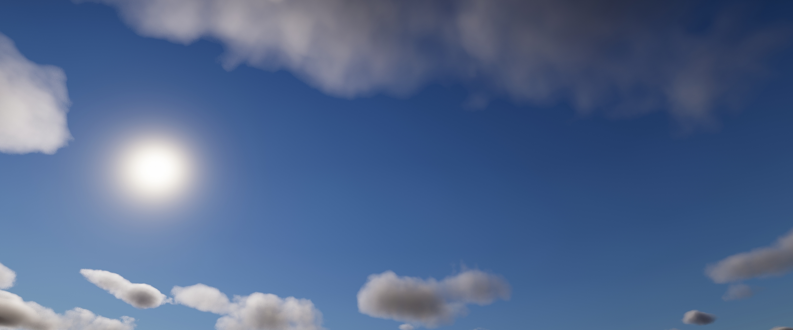
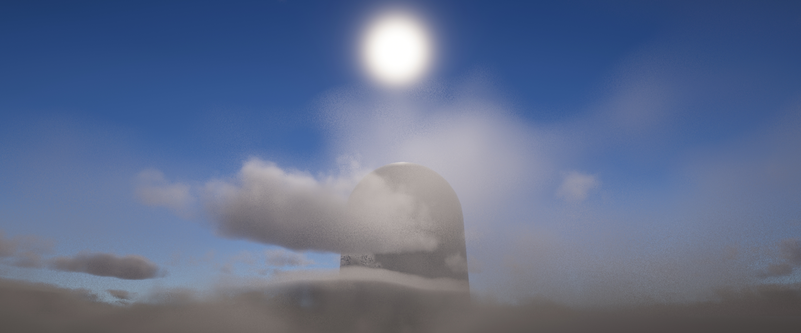

UnityVolumetricCloudsURP
=============
 
 Volumetric Clouds for Unity URP (Universal Render Pipeline). The rendering is ported from HDRP.
 
 **Please read the Documentation and Requirements before using this repository.**
 
Screenshots
------------
**Sample Scene**
 
Global Volumetric Clouds:
 
 
 
**Not Included**
 
Local Volumetric Clouds:
 
 
 
 
 
Documentation
------------
- [How to setup](./Documentation/Setup.md)
 
Requirements
------------
- Unity 2022.2 and URP 14 or above.
- Shader model 3.5 or above (at leaset OpenGL ES 3.0 or equivalent)
 
Reminders
------------
- It is suggested to enable **TAA** rather than using **MSAA** though both are supported.
- It is suggested to set the HDR precision to **64 Bits** in the active URP asset.
- Some settings are still WIP, such as **Wind**, **Custom Cloud Map** overrides.
- Orthographic camera is not supported.
- Clouds shadowmap is not supported.
- The sun lighting should be adjusted manually to support dynamic time of day since URP doesn't support physically based sky.
- The current version is untested on XR platforms, please wait for future updates.
 
License
------------
MIT

 
Details
------------
Please refer to [HDRP Volumetric Clouds Documentation](https://docs.unity3d.com/Packages/com.unity.render-pipelines.high-definition@14.0/manual/Override-Volumetric-Clouds.html#properties).
 